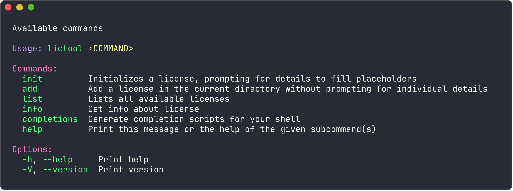

# lictool


**lictool** is a command-line tool that generates SPDX-compatible licenses directly in the terminal. Simply select a license from a list of options, fill in the required information, and quickly create a personalized license for your project. This tool simplifies the process of obtaining the necessary license text, making it efficient and convenient for developers.

## Table Of Contents

- [Usage](#usage)
- [Installation](#installation)
- [Commands](#commands)

## Usage



## Commands

### Init


### Add


### List


### Info


## 🚀 Installation

```bash
cargo install lictool
```

## License

**lictool** is licensed under the [GPL 3.0 only license](LICENSE)
